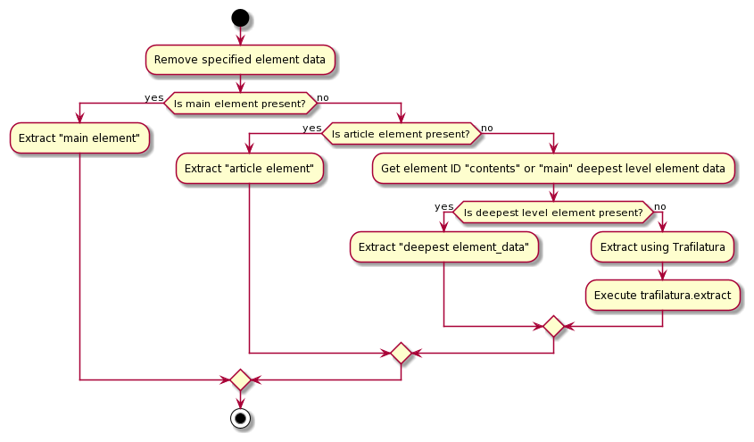

# main_content_extractor

最新情報は英語の[README.md](README.md)です。

## Description

このライブラリは、HTMLからメインコンテンツのみを抽出するためのものです。<br>
LLMに関する情報や、LangChainやLlamaIndexへのデータ投入用に開発しました。<br>
<br>
本ライブラリはHTMLの要素情報や階層情報が含まれているため、これらを利用する際に有用です。<br>
例えば、メインコンテンツのリンク一覧や見出しを取得する際に役立ちます。<br>
<br>
`trafilatura`は非常に優れたメインコンテンツ抽出ライブラリですが、必要なデータが欠落したり、HTMLを出力できないといった問題があります。<br>
これらの問題に対処するために、本ライブラリがあります。<br>
<br>
メインコンテンツ抽出のシーケンスは下記のとおりです。<br>
<br>

<br>
HTML形式の他にText形式、Markdown形式での出力もサポートしています。これは、よりLLMで扱いやすい形式でデータを出力できるようにするためのものです。<br>
<br>
メインコンテンツの抽出には`trafilatura`が使用されています。<br>
`trafilatura`ではHTML形式での出力ができないため、HTML情報が含まれたXML形式で出力され、その後HTMLに変換されています。<br>
XMLからHTMLへの変換は不可逆的なものであり、完全に元のデータと一致するわけではありません。<br>
<br>


## Installration

`pip install git+https://github.com/HawkClaws/main_content_extractor.git`

## HowToUse

```python
import requests
from main_content_extractor import MainContentExtractor

# Get HTML using requests
url = "https://developer.mozilla.org/ja/docs/Web"
response = requests.get(url)
response.encoding = 'utf-8'
content = response.text

# Get HTML with main content extracted from HTML
extracted_html = MainContentExtractor.extract(content)

# Get HTML with main content extracted from Markdown
extracted_markdown = MainContentExtractor.extract(content,output_format="markdown")

```
